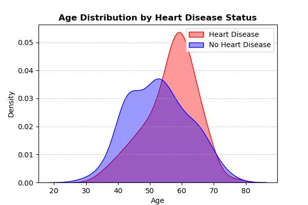
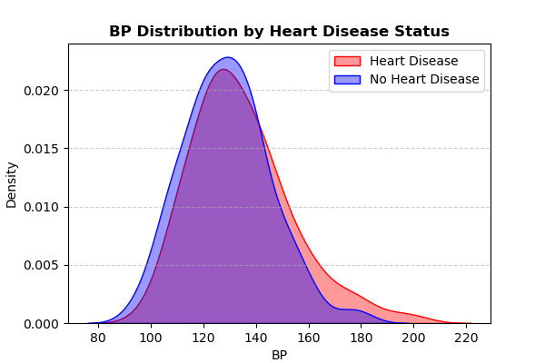
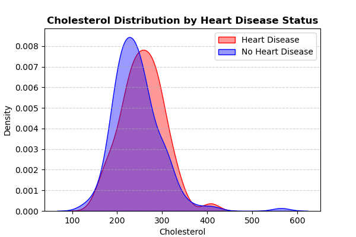
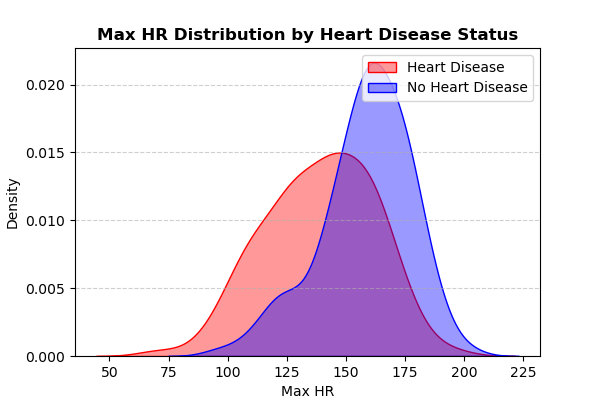

# Heart Disease Risk Analysis & Prediction  
**Prepared By:** Colby Reichenbach  
**Date:** Jan. 27, 2025  

---

## **Executive Summary**  
Heart disease remains a **leading cause of death worldwide**, with early detection and prevention being **critical to improving patient outcomes**. This report analyzes **key risk factors** using **exploratory data analysis (EDA)** and applies **machine learning** to develop a predictive model for **early risk detection**.  

✔ **Key Insights from Data:** Identified high-risk patient profiles.  
✔ **Predictive Modeling:** Developed a model that can flag potential high-risk patients.  
✔ **Hospital Implementation:** Model can assist doctors in early risk detection.  
✔ **Ethical Considerations:** AI should be a **decision-support tool**, not a replacement for medical professionals.  

---

## **Dataset Overview**
**Source:** [UCI Machine Learning Repository](https://archive.ics.uci.edu/dataset/45/heart+disease)  
**Patients:** 270 individuals  
**Features:** Age, Blood Pressure, Cholesterol, Chest Pain Type, Exercise Angina, etc.  
**Target Variable:** `"Heart Disease"` (Presence or Absence)  

### **Heart Disease Prevalence**  
  

  **44.4% of patients (120 out of 270) were diagnosed with heart disease**, while **55.6% (150 patients) did not have heart disease**.

---

## **Key Findings**

### **Age & Heart Disease Risk**  
  
- **Patients over 55** have a significantly **higher likelihood of heart disease**.
- The **average age of heart disease patients is 54.4 years**.

---

### **Blood Pressure & Cholesterol Are Strong Indicators**  
  
  
- **Patients with BP > 140 mmHg** had a **43.1% increased likelihood** of heart disease.
- **High cholesterol (> 240 mg/dL)** is present in **47.9% of heart disease cases**.

---

### **Max Heart Rate (Max HR) & Heart Disease**  
  
- **Patients with Max HR < 140 bpm** had a **28.6% higher risk** of heart disease.
- Lower **cardiovascular fitness** is associated with increased risk.

---

### **ST Depression (Exercise-Induced Ischemia)**  
  
- **ST depression above 2.0** is **moderately correlated** with heart disease.
- Patients with **higher ST depression values** are more likely to have ischemia-related issues.

---

### **Chest Pain Type vs. Heart Disease**  
  
- **Type 4 Chest Pain (Typical Angina) is strongly associated with heart disease.**
- **Type 3 Chest Pain (Non-Anginal) is more common in patients without heart disease.**

---

### **Exercise-Induced Angina & Risk**  
  
- **25.8% of patients who experience exercise-induced angina** were diagnosed with heart disease.
- **This makes exercise angina one of the strongest predictors of cardiovascular issues.**

---

### **Sex & Heart Disease Prevalence**  
  
- **45.4% of males were diagnosed with heart disease**, a significantly higher rate than females.

---

### **Feature Correlation Heatmap**  
  
  **Strongest predictors of heart disease:**  
✔ **Chest Pain Type** (+)  
✔ **Exercise Angina** (+)  
✔ **Max HR** (−)  
✔ **ST Depression** (+)  
✔ **Number of Fluoroscopy Vessels** (+)  

---

## **Preventative Care & Recommendations**  
Given the findings, the hospital should focus on **preventative measures** to **reduce heart disease risk** in patients.  

✔ **Routine Screenings:**  
   - Patients **over 50** should be screened regularly for **BP, cholesterol, and Max HR changes**.  

✔ **Lifestyle Counseling:**  
   - Encourage **heart-healthy diets** and **regular exercise** to maintain cardiovascular health.  

✔ **Early Intervention:**  
   - Patients with **exercise-induced angina, high BP, or ST depression** should receive **preventative medication & lifestyle guidance**.

✔ **Blood Sugar & Heart Disease:**  
   - **42.5% of patients with fasting blood sugar > 120 mg/dL** had heart disease.  
   - **Diabetes prevention & management** should be a **priority for cardiovascular health**.  

---

## **Machine Learning Model for Predicting Heart Disease**
To assist doctors, we developed a **predictive model** to help **flag high-risk patients** before symptoms worsen.  
The model was trained on **patient data** and evaluated using **various machine learning algorithms**.

### **Best Model: Logistic Regression**  
✔ **Accuracy:** 87%  
✔ **AUC-ROC Score:** 92% (Excellent performance in identifying at-risk patients)  

---

### **Model Performance Metrics**
  
  

---

### **Feature Importance (SHAP Analysis)**  
  

**Key Factors Affecting Heart Disease Risk:**  
- **Sex (Male = Higher Risk)**  
- **Chest Pain Type (More severe chest pain = higher risk)**  
- **Exercise Angina (Direct correlation with risk)**  
- **Max HR (Lower HR = Higher risk)**  
- **ST Depression (Higher values indicate ischemia)**  

---

## **How the Model Can Help the Hospital**
✔ **Early Warning System:** Flags **high-risk patients** based on their medical history.  
✔ **Doctor Decision Support:** Helps doctors prioritize **at-risk patients for early intervention**.  
✔ **Personalized Treatment Plans:** Enables better **resource allocation** for high-risk individuals.

---

## **Ethical Considerations in AI for Healthcare**
While **machine learning can improve diagnostics**, it **must not replace doctors**.  

**Key Ethical Points:**  
✔ **Bias Awareness:** The model should be **continuously monitored for biases**, especially across different demographics.  
✔ **Human Oversight:** **Doctors should make the final decision**, using the AI model as a **support tool**.  
✔ **Data Privacy:** Patient data should remain **confidential** and follow **hospital privacy regulations**.

**AI models are not perfect—doctors should validate predictions before making medical decisions.**

---

## **Final Recommendations for Hospital Implementation**
   **Use the AI model as a screening tool** to flag patients who need additional testing.  
   **Regularly review flagged cases** with medical professionals to improve accuracy.  
   **Expand the model** by integrating additional patient health metrics (e.g., lifestyle factors, genetic history).  
   **Monitor for biases** to ensure fair & ethical usage in patient care.  

**By combining AI with medical expertise, the hospital can save lives, and help cut paitent's medical costs, through early detection & prevention!**  

---

## 📧 **Contact Information**
📌 **Analyst:** Colby Reichenbach  
📩 **Email:** [colbyrreichenbach@gmail.com](mailto:colbyrreichenbach@gmail.com)  
🔗 **LinkedIn:** [colby-reichenbach](https://www.linkedin.com/in/colby-reichenbach/)  

---
