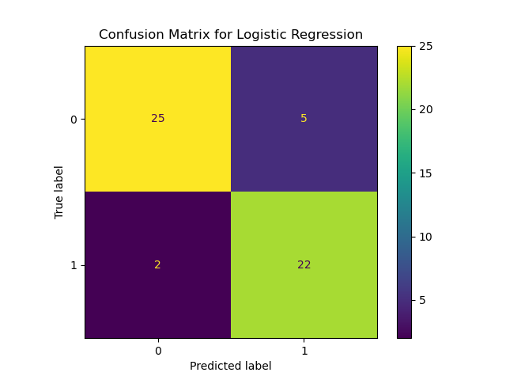

# 🏥 Heart Disease Risk Analysis & Prediction  
**Prepared By:** Colby Reichenbach  
**Date:** Jan. 27, 2025   

---

## **Executive Summary**  
Heart disease remains a **leading cause of death worldwide**. As healthcare professionals, **early detection and prevention** are key to reducing mortality rates. This report examines **patient data from a hospital study** and applies **machine learning** to predict **heart disease presence**, enabling **early intervention and better patient outcomes**.

✔ **Key Insights from Data:** Identified high-risk patient profiles.  
✔ **Predictive Modeling:** Developed a model that can flag potential high-risk patients.  
✔ **Hospital Implementation:** Model can assist doctors in early risk detection.  
✔ **Ethical Considerations:** AI should be a **decision-support tool**, not a replacement for medical professionals.  

---

## 📂 **Dataset Overview**
   **Source:** [UCI Machine Learning Repository](https://archive.ics.uci.edu/dataset/45/heart+disease)  
   **Patients:** 303 individuals  
   **Features:** Age, Blood Pressure, Cholesterol, Chest Pain Type, etc.  
   **Target Variable:** `"Heart Disease"` (Presence or Absence)  

** Distribution of Patients with Heart Disease:**  

---

## 🔍 **Key Findings from Exploratory Data Analysis (EDA)**

### **Age & Heart Disease Risk**  
Older patients have a **higher likelihood of heart disease**, with cases rising significantly **after age 50**.  

**Age Distribution of Patients**  

### **Blood Pressure & Cholesterol Are Strong Indicators**  
- Patients with **high blood pressure (BP > 140)** and **high cholesterol levels** had a **higher prevalence of heart disease**.  
- **High cholesterol levels** appear to be a consistent risk factor across all age groups.  

**Cholesterol Levels by Heart Disease Status**  

**Blood Pressure by Heart Disease Status**  

---

## **Preventative Care & Recommendations**
Given the findings, the hospital should focus on **preventative measures** to **reduce heart disease risk** in patients.  

✔ **Routine Screenings:** Blood pressure & cholesterol should be monitored regularly, especially for **patients over 50**.  
✔ **Lifestyle Counseling:** Encourage patients to adopt **heart-healthy diets** and **exercise regularly**.  
✔ **Early Intervention:** Patients flagged as high-risk should receive **preventative medication & lifestyle guidance**.

---

## **Machine Learning Model for Predicting Heart Disease**
To assist doctors, we developed a **predictive model** to help **flag high-risk patients** before symptoms worsen.  
The model was trained on **patient data** and evaluated using **various machine learning algorithms**.

**Best Model: Logistic Regression**  
✔ **Accuracy:** 87%  
✔ **AUC-ROC Score:** 91.8% (Excellent separation between healthy & at-risk patients)  

**Model Performance Metrics**  
  

---

## **How the Model Can Help the Hospital**
   **Early Warning System:** Automatically flags **high-risk patients** based on their medical history.  
   **Doctor Decision Support:** Helps doctors prioritize **at-risk patients for early intervention**.  
   **Personalized Treatment Plans:** Enables better **resource allocation** for high-risk individuals.

---

## **Ethical Considerations in AI for Healthcare**
While **machine learning can improve diagnostics**, it **must not replace doctors**.  

**Key Ethical Points:**  
✔ **Bias Awareness:** The model should be **continuously monitored for biases**, especially across different demographics.  
✔ **Human Oversight:** **Doctors should make the final decision**, using the AI model as a **support tool**.  
✔ **Data Privacy:** Patient data should remain **confidential** and follow **hospital privacy regulations**.

**AI models are not perfect—doctors should validate predictions before making medical decisions.**

---

## **Final Recommendations for Hospital Implementation**
Based on our findings, we propose:  
- **Use the AI model as a screening tool** to flag patients who need additional testing.  
- **Regularly review flagged cases** with medical professionals to improve accuracy.  
- **Expand the model** by integrating additional patient health metrics (e.g., lifestyle factors, genetic history).  
- **Monitor for biases** to ensure fair & ethical usage in patient care.  

**By combining AI with medical expertise, the hospital can save lives through early detection & prevention!**

---

## 📧 **Contact Information**
📌 **Analyst:** Colby Reichenbach  
📩 **Email:** [colbyrreichenbach@gmail.com](colbyrreichenbach@gmail.com)
🔗 **LinkedIn:** [colby-reichenbach](https://www.linkedin.com/in/colby-reichenbach/)

---
